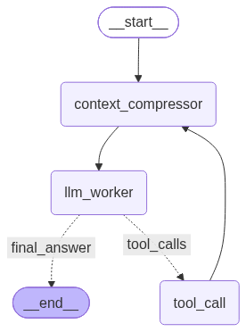

### Coding Harness Worklfow
LangGraph graph:  

## Done:
- skills' integration
- provider agnosticism (integrated openai library - supported by multiple providers)

### TODO:
- streaming response to user
- circular import (task_delegation and sub_agent nodes) resolution once and for all
- proper context setup (like claude.md or something)
- edit file tool to perform changes in specific parts in file
- langsmith -> langfuse